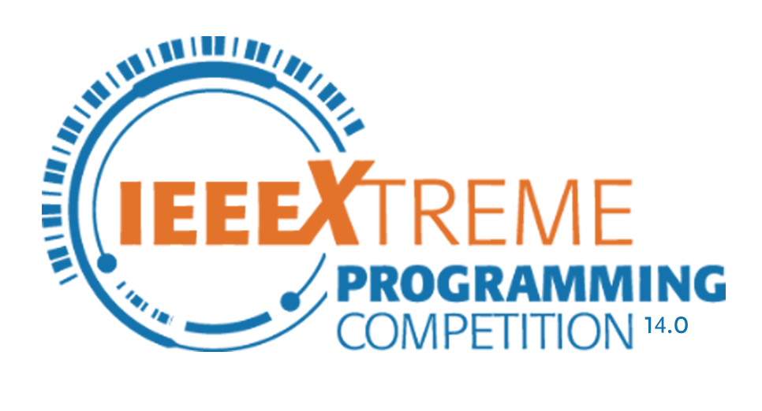

  

<h1 align="center">IEEEXtreme 14.0 Solutions</h1>

Welcome to the IEEEXtreme 14.0 Solutions Repository! This repository contains my solutions to problems from the IEEEXtreme 14.0 programming competition. Each folder corresponds to a specific problem and includes both the problem statement (PDF) and my solution.

## Problems Solved

1. [IEEEXplore Indexing](./IEEEXplore_indexing)
2. [Mosaic Decoration I](./Mosaic_Decoration_I)
3. [Mosaic Decoration II](./Mosaic_Decoration_II)
4. [Mosaic Decoration III](./Mosaic_Decoration_III)
5. [Poker Game](./Poker_Game)
6. [Rescue Mission](./Rescue_Mission)
7. [Coin Collector](./coin_collector)
8. [Game of Life 2020](./game_of_life_2020)
9. [Hotel Wiring](./hotel_wiring)
10. [Linearly Separable Samples](./linearly_seperable_samples)
11. [Magical Stones I](./magical_stones_I)
12. [Non-Overlapping Palindromes](./non_overlapping_palindromes)

## Repository Structure

Each problem folder typically contains:
- A PDF file with the problem statement
- Solution file

## Disclaimer

These solutions are my own work and were created for educational purposes. They may not be the most optimal solutions, but they passed the competition's test cases.

## Contributing

While this repository is primarily for personal use, suggestions for improvements or alternative solutions are welcome. Feel free to open an issue or submit a pull request.

## License

This project is open source and available under the [MIT License](LICENSE).

